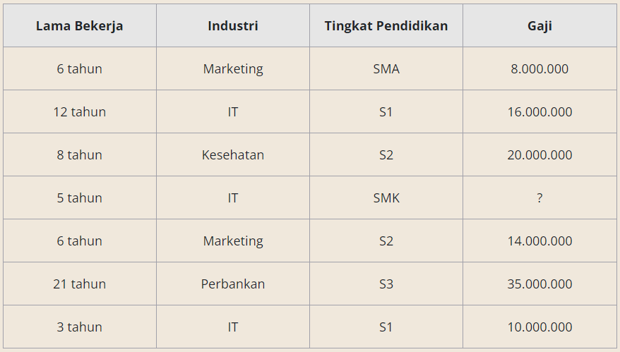
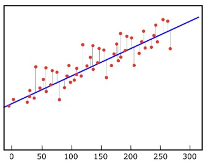
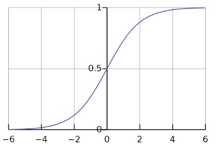

# Supervised : Regression
Regresi adalah salah satu teknik ML yang mirip dengan klasifikasi.

Bedanya pada klasifikasi, `sebuah model klasifikasi memprediksi sebuah kelas`, sedangkan `model regresi memprediksi bilangan kontinu. Bilangan kontinu adalah bilangan numerik.`

Jadi model klasifikasi memprediksi kelas atau kategori dan model regresi memprediksi sebuah nilai berdasarkan atribut yang tersedia. 

Pada submodul ini jenis regresi yang akan dibahas adalah regresi linier. Selain regresi linier terdapat juga jenis regresi lain seperti `regresi polinomial`, `lasso regression`, `stepwise regression` dan sebagainya.

## Linear Regression
Regresi linier adalah salah satu metode supervised yang masuk dalam golongan regression, sesuai namanya. Contoh paling terkenal dari regresi linier adalah memperkirakan harga rumah berdasarkan fitur yang terdapat pada rumah seperti luas rumah, jumlah kamar tidur, lokasi dan sebagainya. Ini adalah model paling sederhana yang perlu diketahui guna memahami metode machine learning lain yang lebih kompleks. Regresi linier cocok dipakai ketika terdapat hubungan linear pada data. Namun untuk implementasi pada kebanyakan kasus, ia kurang direkomendasikan. Sebabnya, regresi linier selalu mengasumsikan ada hubungan linier pada data, padahal tidak.

Ketika sebuah garis regresi digambar, beberapa data akan berada pada garis regresi dan beberapa yang lainnya akan berada di dekat garis tersebut. Sebabnya, garis regresi adalah sebuah model probabilistik dan prediksi kita adalah perkiraan. Jadi tentu akan ada eror/penyimpangan terhadap nilai asli dari variabel Y. Pada gambar di bawah, garis abu-abu (garis dari titik merah) yang menghubungkan data-data ke garis regresi (garis biru) merupakan error. Semakin banyak eror artinya model regresi itu belum optimal.

## Logistic Regression
Sesuai namanya, logistic regression menggunakan fungsi logistik seperti di bawah untuk menghitung probabilitas kelas dari sebuah sampel. Contohnya sebuah email memiliki probabilitas 78% merupakan spam maka email tersebut termasuk dalam kelas spam. Dan jika sebuah email memiliki <50% probabilitas merupakan spam, maka email tersebut diklasifikasikan bukan spam.

