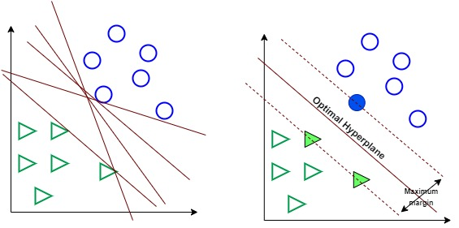

# Support Vector Machine
Vladimir N Vapnik, seorang Professor dari Columbia, Amerika Serikat pada tahun 1992 memperkenalkan sebuah algoritma training yang bertujuan untuk memaksimalkan margin antara pola pelatihan dan batas keputusan (decision boundary) [10]. Algoritma ini kemudian dikenal luas sebagai Support Vector Machine (SVM).

Support Vector Machine adalah model ML multifungsi yang dapat digunakan untuk menyelesaikan permasalahan klasifikasi, regresi, dan pendeteksian outlier. Termasuk ke dalam kategori supervised learning, SVM adalah salah satu metode yang paling populer dalam machine learning. Siapa pun yang tertarik untuk masuk ke dalam dunia ML, perlu mengetahui SVM.

Tujuan dari algoritma SVM adalah untuk menemukan hyperplane terbaik dalam ruang berdimensi-N (ruang dengan N-jumlah fitur) yang berfungsi sebagai pemisah yang jelas bagi titik-titik data input. Untuk lebih jelasnya, perhatikan gambar berikut.

Gambar di sebelah kiri menunjukkan beberapa kemungkinan bidang (hyperplane) untuk memisahkan data lingkaran dan data segitiga. Algoritma SVM kemudian mencari hyperplane terbaik yang dapat memisahkan kedua kelas secara optimal. Seperti tampak pada gambar di sebelah kanan, sebuah hyperplane optimal berhasil dibuat dan mampu memisahkan kedua kelas sehingga memiliki margin yang maksimal.

Beberapa keunggulan Support Vector Machine antara lain:

1. SVM efektif pada data berdimensi tinggi (data dengan jumlah fitur atau atribut yang sangat banyak).

2. SVM efektif pada kasus di mana jumlah fitur pada data lebih besar dari jumlah sampel.

3. SVM menggunakan subset poin pelatihan dalam fungsi keputusan (disebut support vector) sehingga membuat penggunaan memori menjadi lebih efisien.                 

Pada modul ini kita akan belajar tentang bagaimana Support Vector Machine dapat menyelesaikan permasalahan klasifikasi dan regresi.

