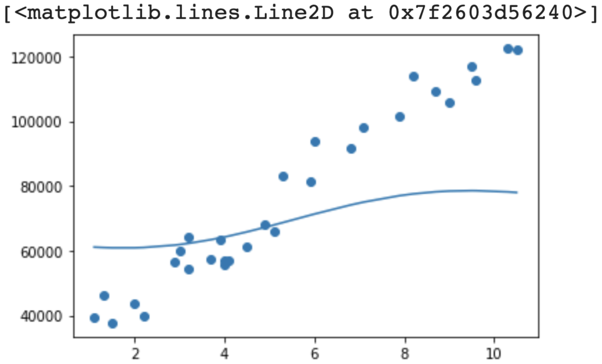

# Latihan SKLearn dengan Teknik Grid Search
## Tujuan
Untuk latihan kali ini kita akan menggunakan grid search untuk mencari parameter terbaik pada sebuah model SVR. Dataset yang kita gunakan sama seperti di modul 3 yaitu dataset gaji. Pada latihan tersebut model belum mampu menyesuaikan pola pada data dengan baik. Tujuan kita adalah menggunakan grid search untuk mencari parameter yang lebih baik bagi model.

## Tahapan Latihan
Tahapan latihan kali ini sebagai berikut:

1. Ubah dataset data menjadi Dataframe.
2. Definisikan parameter yang akan diuji.
3. Jalankan fungsi grid search.
4. Latih model dengan parameter terbaik hasil grid search.
5. Buat plot dari model.