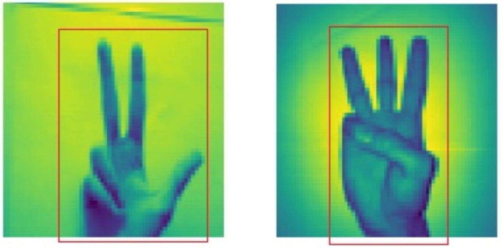
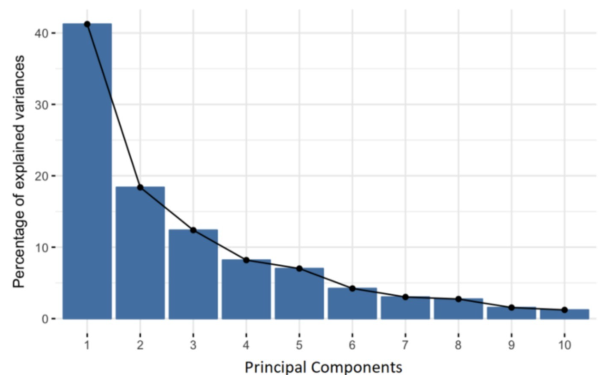
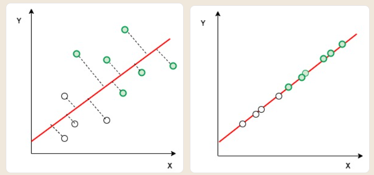
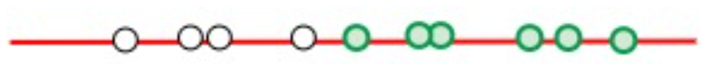

# Dimensionality Reduction : LDA, PCA, t-SNE
Pada tahap ini kita telah belajar mengimplementasikan 2 model machine learning yaitu regresi dan clustering. Dataset yang telah kita gunakan memiliki atribut yang masih sangat sedikit sehingga proses pelatihan model yang kita bangun sebelumnya sangat cepat. Namun, dalam praktiknya, banyak masalah machine learning menggunakan dataset yang memiliki ribuan atau bahkan jutaan atribut, seperti pada dataset yang berisi informasi mengenai genetika manusia. 

Dengan begitu banyaknya atribut, proses pelatihan akan menjadi lambat dan memakan waktu lama. Contoh lain pada kasus image recognition, di mana atribut dari image adalah jumlah pixel dari gambar tersebut. Jika sebuah gambar memiliki resolusi 28 x 28 pixel, maka gambar tersebut memiliki 784 atribut.

Pada 2 gambar di atas, setiap pixel adalah sebuah atribut. Hanya atribut yang berada di dalam kotak merah, yang berguna untuk dipakai dalam pelatihan model ML. Sebaliknya, atribut yang berada di luar kotak merah, tidak berguna dalam pelatihan model. Pengurangan dimensi pada kasus ini adalah dengan membuang pixel atau atribut yang berada di luar kotak merah. Bayangkan jika terdapat 10.000 gambar seperti di atas dalam sebuah dataset. Pengurangan dimensi akan mempercepat pelatihan model secara signifikan.

Ada beberapa teknik dalam pengurangan dimensi. Salah satu metode pengurangan dimensi yang terkenal adalah Principal Component Analysis atau sering disebut PCA.

 

## Principal Component Analysis (PCA)
Secara sederhana, tujuan dari PCA adalah mereduksi dimensi atau mengurangi jumlah atribut pada dataset tanpa mengurangi informasi. Contohnya pada sebuah dataset harga rumah. Pada PCA setiap atribut disebut sebagai principal component. Jika terdapat 10 atribut pada dataset, berarti terdapat 10 principal component. Pada gambar di bawah [9] terdapat histogram dari 10 principal component dan variance dari setiap principal component.

PCA bekerja dengan menghitung variance dari tiap atribut. Variance adalah informasi yang dimiliki sebuah atribut. Misal pada dataset rumah, atribut jumlah kamar memiliki variance atau informasi sebesar 92% dan warna rumah memiliki variance/informasi sebesar 4% tentang harga rumah terkait. Dari hasil perhitungan variance, atribut warna rumah dapat dibuang dari dataset karena tidak memiliki informasi yang cukup signifikan ketika kita ingin mempercepat pelatihan sebuah model.

 

## LDA
Linear Discriminant Analysis atau analisis diskriminan linier adalah teknik statistika yang dipakai untuk reduksi dimensi. LDA bekerja dengan mencari kombinasi atribut terbaik yang dapat memisahkan kelas-kelas pada dataset dan meminimalkan varian pada masing-masing kelas. Kontras dengan PCA yang bekerja dengan mencari atribut komponen yang memiliki varian tertinggi.

Perbedaan mendasar lain yang membedakan LDA dan PCA adalah PCA merupakan teknik unsupervised karena pada pengurangan dimensi, PCA tidak menghiraukan label yang terdapat pada dataset. Sedangkan LDA merupakan teknik supervised karena LDA memperhatikan bagaimana kelas-kelas pada data dapat dipisahkan dengan baik. 

Tujuan LDA adalah mengurangi dimensi dataset berdimensi-i dengan memproyeksikannya ke subruang berdimensi-j, di mana j<i. LDA menggunakan fitur dari kedua sumbu (X dan Y) untuk membuat sumbu baru, kemudian memproyeksikan data ke sumbu baru dengan cara meminimalkan varians dan memaksimalkan jarak antara dua kategori. Dengan demikian, dua kriteria utama yang digunakan LDA untuk membuat sumbu baru adalah.

Meminimalkan varian pada masing-masing kelas.

Memaksimalkan jarak antara rata-rata (mean) kedua kelas.

Secara sederhana, berikut adalah contoh ilustrasi bagaimana LDA menggunakan dua kriteria di atas untuk mereduksi dimensi. 

Pada kedua gambar diatas, tampak bahwa sumbu baru yang berwarna merah telah dibuat dan diplot di grafik 2D sedemikian rupa sehingga memaksimalkan jarak antara rata-rata (mean) dari kedua kelas dan meminimalkan varian dari setiap kelas. Dengan kata lain, sumbu ini meningkatkan pemisahan titik-titik data dari kedua kelas. Setelah membuat sumbu baru dengan kriteria yang telah disebutkan di atas, semua titik-titik data kemudian diplot pada sumbu baru seperti tampak pada gambar di sebelah kanan.

Hasil akhirnya akan tampak seperti gambar berikut.

Bagaimana, mudah dipahami, kan? Ilustrasi di atas menggunakan data yang sederhana agar kita lebih mudah memahami tentang LDA. Perlu diingat bahwa pada kenyataannya, dataset yang ada tentu tidak sesederhana ini. 

Silakan kunjungi tautan berikut untuk membaca lebih lanjut mengenai LDA, juga tautan berikut untuk memahami LDA dengan library scikit-learn. 

 

## t-SNE
t-Distributed Stochastic Neighbor Embedding atau sering disebut t-SNE dikembangkan oleh Laurens van der Maaten dan Geoffrey Hinton pada tahun 2008. t-SNE adalah teknik non linear unsupervised yang digunakan untuk reduksi dimensi, eksplorasi data, dan visualisasi data berdimensi tinggi. 

Algoritma t-SNE memungkinkan kita untuk memisahkan data yang tidak dapat dipisahkan oleh garis linear. Dengan t-SNE kita bisa melihat visualisasi bagaimana data tersusun pada ruang berdimensi tinggi. Lalu, bagaimana cara kerja algoritma t-SNE?

t-SNE menghitung ukuran kesamaan antara pasangan titik data di ruang berdimensi tinggi dan dimensi rendah, kemudian mengoptimalkan dua kesamaan ini. Dengan kata lain, t-SNE mengurangi dimensi dengan menjaga sampel-sampel yang mirip agar berdekatan, dan sebaliknya, sampel-sampel yang kurang mirip, berjauhan. 

Cyrille Rossant dalam tulisannya An Ilustrated Introduction to the t-SNE Algorithm membuat visualisasi handwriting digit dengan t-SNE sebagai berikut.

Laurens Van der Maaten pada acara Google Tech Talks menyampaikan langkah-langkah dalam algoritma t-SNE sebagai berikut. Pertama, menghitung ukuran kesamaan antara pasangan pada ruang berdimensi tinggi. Selanjutnya, menghitung ukuran kesamaan antara pasangan pada ruang berdimensi rendah. Langkah terakhir, kita ingin himpunan probabilitas dari ruang berdimensi rendah untuk mencerminkan ruang berdimensi tinggi sebaik mungkin sehingga diharapkan kedua struktur peta serupa. 

Dengan teknik ini, t-SNE mampu menangkap banyak struktur lokal dari data berdimensi tinggi dengan sangat baik, sekaligus menunjukkan struktur global seperti keberadaan cluster di beberapa skala. t-SNE sering dipakai untuk visualisasi data yang memiliki dimensi besar dan dipakai luas dalam pemrosesan gambar, pemrosesan bahasa alami, data genomika, dan speech processing. 

Jika tertarik mempelajari lebih lanjut tentang t-SNE, silakan kunjungi laman pribadi L. V. Maaten, ilmuwan yang menemukan teknik t-SNE pada tautan berikut. Untuk memahami bagaimana implementasi t-SNE dengan bahasa pemrograman python, silakan kunjungi tautan berikut, serta tautan berikut untuk memahami implementasi t-SNE dengan library scikit-learn. 